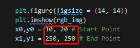

# Pixel Maze

A Python program that visualizes the process of solving a maze by skeletonizing an image and finding the optimal path between two points.

## Installation

1. **Clone the Repository:**

  ```bash
  git clone https://github.com/luc1d-ed/Pixela-Maze.git
  cd Pixela-Maze
  ```
  Alternatively, download the ZIP file and extract it.

2. **Install Dependencies:**
Ensure you have Python installed, then install the required packages using:

```
pip install -r requirements.txt
```

## Setup

It's recommended to use Jupyter Notebook, especially for marking the start and end points.

1. **Choose Your Maze:**
   
    Obtain a maze image you want to solve (e.g., from [Maze Toys](https://maze.toys/))
   
1. **Place the Image in the Appropriate Directory:**
  
  ```
  Pixela-Maze/
├── Mazes/
│   ├── Maze.toys/
│   │   └── {image_file}
│   ├── Examples/
├── Breadth-first.py
├── Notebook.ipynb
├── requirements.txt
  ```

3. **Update the Image Path:**
   
    In the Jupyter Notebook, update the filename in the second code block (or on line 11):
    

4. **Set Start and End Points:**
   
   

5. **Run the Notebook:** 
   
   Execute the cells one by one to solve your maze.
   
## Contributing

Feel free to open issues or submit pull requests for any improvements.
